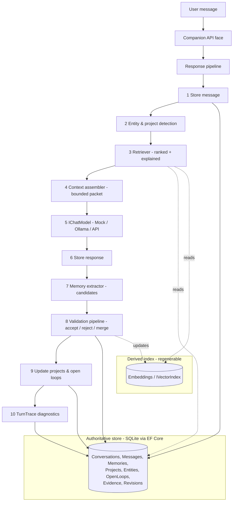

# Persistent Companion — Architecture

This document describes the proposed components, data flow, storage model, retrieval
process, memory lifecycle, and model boundaries. It is deliberately conservative: a
single developer should be able to hold the whole thing in their head.

## Design principles

1. **Relational store is authoritative.** Embeddings/vectors are a derived, regenerable index.
2. **Model providers are swappable.** No vendor type appears in core logic.
3. **Extraction ≠ acceptance.** The LLM proposes candidate memories; a deterministic
   pipeline decides what is stored.
4. **Everything is provenanced.** Every memory traces to the messages that produced it,
   with confidence and a lifecycle state.
5. **Time is first-class.** "When it happened", "when it was mentioned", and "when it
   was recorded" are distinct. New facts supersede; they do not erase.
6. **One responsibility per component.** No giant services, no speculative abstractions.

## Technology choices

- **Runtime:** .NET 9, nullable reference types on, async + `CancellationToken`.
- **Storage:** EF Core over **SQLite** (authoritative). Embeddings stored as `BLOB`.
- **Vector search:** exact in-process cosine behind `IVectorIndex`, backed by an in-memory cache
  (`InMemoryVectorIndex`) that cold-loads a user's embeddings once and is kept in step by a
  write-through hook (`IVectorIndexMaintenance`, called by the memory store after every save) — no
  per-turn BLOB re-read, no staleness. Still the swap point for a dedicated ANN store (sqlite-vec,
  Qdrant, …) if exact O(n) ever stops being enough.
- **Models:** `Mock` (default, for dev/tests), `Ollama` (local), `OpenAiCompatible`
  (hosted) — each behind role interfaces.
- **Config/DI/logging:** `Microsoft.Extensions.*` + `ILogger` structured logs.
- **Tests:** xUnit with an in-memory/SQLite-file store and mock models.

## Solution layout

```
Persisten_AI.sln
├── src/
│   ├── Companion.Core/            # domain records, enums, interfaces, pure services
│   ├── Companion.Infrastructure/  # EF Core store, vector index, model adapters
│   └── Companion.Api/             # headless HTTP + WebSocket face (+ reference web client)
└── tests/
    └── Companion.Tests/           # unit, integration, e2e scenarios, seed data
```

Interfaces live in `Companion.Core`; implementations live in `Companion.Infrastructure`.
This is what keeps persistence and model providers decoupled — `Core` depends on neither
EF Core nor any LLM SDK.

## Components

### Core (pure, no I/O)

- **Domain records** — see "Domain model" below.
- **Interfaces**
  - Model roles: `IChatModel`, `IEmbeddingModel`, `IMemoryExtractor`, `ISummarizer`, `IReranker`.
  - Storage: `IMemoryStore`, `IConversationStore`, `IProjectStore`, `IEntityStore`, `IVectorIndex`,
    `IEmotionStore` (append-only emotional-signal log).
  - Services: `IRetriever`, `IContextAssembler`, `IMemoryPipeline`, `IEntityResolver`, `ICompanion`,
    `IRelationshipTracker` (derives how things have been feeling from the signal log).
- **Pure services** — scoring/ranking math, temporal validity rules, dedup/normalization,
  confidence calculation, and deterministic detectors (`MoodDetector` for a message's emotional tone,
  `CommitmentDetector` for the companion's own promises). No database, no network → trivially unit-testable.

### Infrastructure (I/O)

- `CompanionDbContext` (EF Core, SQLite) + entity configurations + migrations.
- Store implementations backed by the DbContext.
- `InMemoryVectorIndex` implementing `IVectorIndex` (exact cosine over embeddings held in memory;
  cold-loaded per user from the tables, then kept in step through the store's write-through hook).
- Model adapters: `MockChatModel`/`MockEmbeddingModel`, `OllamaChatModel`, etc.

### API (the face)

- `Companion.Api`: a local HTTP + SSE + WebSocket service wrapping `IAgent`; replies stream
  token-by-token. A small `wwwroot/index.html` reference web client ships with it.
- Conversational endpoints (`/chat`, `/chat/stream`, `/ws`, `/transcribe`) plus structured reads
  (`/memories`, `/projects`, `/loops`, `/persona`, `/personality`, `/identity`, `/feedback`, `/greeting`).
- Memory control (recall, correct, forget, consolidate) is driven by plain-language intents
  through `/chat` — the same brain either way.

## Domain model

Records (composition over inheritance; discriminated by explicit `Kind`/`Status` enums,
**not** a class hierarchy):

| Record | Purpose | Key fields |
|--------|---------|-----------|
| `UserProfile` | Identity + isolation root | `UserId`, display name, settings |
| `Conversation` | A thread | `Id`, `UserId`, title, model used, source, timestamps |
| `Message` | One turn | `Id`, `ConversationId`, `UserId`, role, content, `ReplyToId`, tokens, timestamp |
| `SemanticMemory` | Durable fact/preference | subject, predicate, value, confidence, `FirstObserved`, `LastConfirmed`, `Validity`, `SupersededById` |
| `EpisodicMemory` | Something that happened | description, `EventTime`, `TimePrecision`, `MentionedAt`, `CreatedAt`, entities, project, importance, emotion?, confidence, `Status` |
| `Project` | First-class project | name, aliases, purpose, status, goals, decisions, tech, people, milestones, open questions, blockers, abandoned approaches, related convs/files |
| `ProjectEvent` | Activity-log entry | `ProjectId`, time, kind, description, source |
| `Decision` | A recorded choice | `ProjectId?`, statement, rationale, time, supersession |
| `OpenLoop` | Unfinished matter | description, owner, `ProjectId?`, `CreatedAt`, `ExpectedFollowUp?`, `Status`, source, closure evidence |
| `Entity` | A referenced thing | `Id`, `UserId`, canonical name, type, confidence |
| `EntityAlias` | Alternate reference | `EntityId`, alias text, source, confidence |
| `Relationship` | Link between entities | subject, predicate, object, confidence, source |
| `MemoryEvidence` | Provenance | `MemoryId`, `MessageId`, excerpt, weight |
| `MemoryRevision` | Audit trail | `MemoryId`, timestamp, change kind, before/after, actor |
| `RetrievalResult` | One ranked hit (runtime/log) | memory ref, score, per-signal breakdown, match reason |
| `ContextPacket` | What the model sees (runtime) | sections + provenance labels + token budget |

### Memory lifecycle

```
Candidate ──accept──► Active ──newer fact──► Superseded
    │                   │  └──user "that's wrong"──► Disputed
    └──reject──►(discarded, logged)         │
                        └──user "forget"────► Deleted (soft; excluded everywhere)
```

- **Candidate** — proposed by extraction, not yet trusted.
- **Active** — accepted, current, retrievable.
- **Superseded** — replaced by a newer fact; kept for history, not presented as current.
- **Disputed** — user flagged it wrong; retrieval demotes/annotates until resolved.
- **Deleted** — soft-deleted; never retrieved, summarized, or embedded again.

### Temporal model

Three distinct timestamps, plus validity:

- `EventTime` (+ `TimePrecision`: Exact / Day / Month / Year / Approximate) — when it happened.
- `MentionedAt` — when the user said it.
- `CreatedAt` — when the memory record was written.
- `Validity` = `Current | Historical | Temporary | Superseded`, with `ValidFrom` /
  `ValidTo`. "I'm eating low carb **this week**" → `Temporary`; a replaced device →
  `Historical` after supersession.

## Data flow — a conversation turn

1. Receive the user message.
2. **Store** the raw message.
3. **Detect** likely entities and project references (alias match + embeddings).
4. **Retrieve** relevant memories (ranked, explained) under a token budget.
5. **Assemble** a bounded `ContextPacket` (fact vs. inference vs. stale clearly labeled).
6. **Generate** the assistant response via `IReplyGenerator`, which drives the `IChatModel`
   transport and owns *when to keep going*: continue a reply cut off by the token limit
   (`finish_reason: "length"`), or — for a reply that stopped on its own but looks unfinished —
   ask a small-model `ICompletionJudge` and continue on its say-so, feeding the text so far back
   each round so it resumes the same task. Bounded by `MaxContinuations`; the judge fails closed.
7. **Store** the response, with its generation metadata (`finish_reason`, rounds, truncated,
   model, token usage) so how each reply was produced is recorded, not guessed. A reasoning model's
   `<think>…</think>` trace is stripped first (`ReasoningFilter`) — it's never shown, stored, or fed
   back next turn, since replaying a small model's own reasoning + replies drives it to repeat itself.
8. **Extract** candidate memory updates via `IMemoryExtractor`.
9. **Validate & persist** accepted updates through the deterministic pipeline.
10. **Update** project state and open loops.
11. **Record** a `TurnTrace` (retrieval + extraction decisions) for debugging.

Steps 1–7 are the synchronous, user-facing path and must stay fast. Steps 8–11 are
cheap enough to run inline initially, but are designed so they can move to a background
consolidation command/service later without changing the domain model.

## Retrieval process

Hybrid scoring over `Active` (and, when relevant, `Superseded`) memories:

```
score = w1·semanticSimilarity      // cosine over embeddings
      + w2·keywordOverlap          // lexical match
      + w3·entityMatch             // resolved-entity hit
      + w4·projectAssociation      // same project as detected context
      + w5·recency                 // time-decayed
      + w6·importance              // stored importance
      + w7·openLoopBoost           // unresolved & contextually relevant
      + w8·temporalRelevance       // matches the time the user is talking about
      + w9·confidence              // down-weight low-confidence memories
```

Weights are configuration-bound. Output is a **ranked list of `RetrievalResult`**, each
with its per-signal breakdown and a human-readable match reason. Retrieval returns only
the top-K that fit the token budget — **never a full dump**. Superseded/historical hits
are included only when the user is clearly talking about the past, and are labeled as such.

Before ranking, a memory must clear a **relevance floor** (`Companion.RelevanceFloor`,
default `0.15`) on its *topical* signals alone — semantic similarity + keyword overlap +
project match. Recency, importance, and confidence order the memories that pass, but they
can't admit one on their own: without the floor a merely recent or important fact outscores
`MinScore` with zero relevance to the turn, so unrelated things the companion "knows about
the user" bleed into every reply (and a small model can fuse them into a fabricated claim).
The floor is the same gate the open-loop boost already uses.

## Memory extraction & acceptance pipeline

Extraction (LLM) is strictly separated from acceptance (deterministic):

1. **Generate** candidates (structured JSON, schema-constrained) from the exchange.
2. **Normalize** subjects/predicates/values and dates.
3. **Detect duplicates** (embedding + string similarity against existing memories).
4. **Compare** to existing memory (new / confirmation / update / contradiction).
5. **Calculate confidence** (source directness, corroboration count, recency).
6. **Validate evidence** — every accepted memory must cite ≥1 source message.
7. **Decide**: accept / reject / merge / mark-for-review.
8. **Persist** with `MemoryEvidence` links and a `MemoryRevision` entry.

The model can *propose* anything; it can *write* nothing directly.

## Context assembly

The `ContextPacket` contains only what the turn needs, with each section explicitly labeled:

- recent conversation (verbatim),
- relevant user facts (**direct statement** vs. **inferred**),
- relevant episodes,
- current project state,
- open loops,
- entity summaries,
- **uncertainty notes** and any **conflicting / superseded** info called out as such.

The assembler enforces a token budget and always distinguishes direct user statements,
system-generated summaries, uncertain inferences, and outdated information.

## Model boundaries

Roles are separate interfaces so one provider *may* implement several without binding the
system to it:

| Role | Interface | Initial impl |
|------|-----------|--------------|
| Chat completion | `IChatModel` | Mock → Ollama / OpenAI-compatible |
| Embeddings | `IEmbeddingModel` | Mock (deterministic hash-embeddings) → real |
| Memory extraction | `IMemoryExtractor` | Mock (rule-based) → LLM-backed |
| Summarization | `ISummarizer` | Mock → LLM-backed |
| Reranking | `IReranker` | identity (score-order) → LLM/cross-encoder |
| Reply generation (continuation policy) | `IReplyGenerator` | `ReplyGenerator` over `IChatModel` |
| Completion check | `ICompletionJudge` | `AlwaysComplete` (mock) → small-model `LlmCompletionJudge` |

`IReplyGenerator` and `ICompletionJudge` sit *above* the raw `IChatModel` transport: the transport
is one request → one reply (+ metadata), and the policy of whether to continue lives in the
generator, so the adapter stays thin and the completion judge can use a separate, cheaper model.

The Mock providers make the entire system runnable and deterministic in tests with no
network or GPU.

## Privacy & isolation

- `UserId` is required and indexed on every record; every store method is scoped by it.
- Local-first (SQLite file). Configurable retention. Full export and full deletion.
- Secrets (API keys) come from configuration/environment — **never** stored as memories.
- Soft-deleted memories are filtered at the store boundary so they cannot resurface via
  retrieval, summaries, or the vector index.

## Minimal Architecture (Mermaid)



The relational store is authoritative (solid writes); the vector index is a derived,
regenerable read path (dashed).
